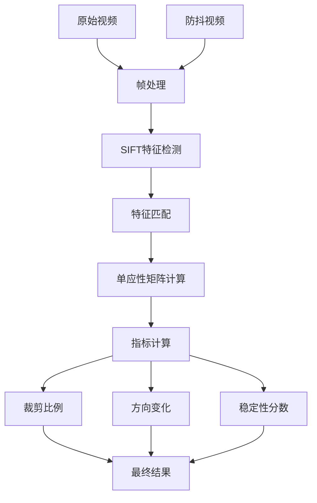

# 防抖稳定性评估工具

该项目是一个专业的视频稳定性评估工具，提供了直观的界面和全面的评估指标，适合研究人员和工程师评估视频稳定算法的效果。

主要功能：

- 选择原始视频和稳定视频文件
- 设置处理分辨率（原生、4K、1080p、720p、480p）
- 执行评估并显示进度
- 展示评估结果（裁剪比率、畸变值、稳定性分数，合成帧的质量）
- 显示轨迹对比图
- 保存轨迹图为图片

处理流程：



## 防抖技术的性能评价指标

指标 | 描述 | 数值越高表示
---|----|-------
裁剪比例 | 防抖后的帧利用率 | 更好地保留原始内容
方向变化 | 相机运动的平滑度 | 更稳定、更少抖动的运动
稳定性分数 | 整体防抖效果 | 更优越的防抖性能

裁剪比（cropping ratio）
衡量在防抖过程中保留了多大比例的原始视野。通过单应性矩阵的尺度分量计算，值越小表示裁剪越严重（画面缩小越多）。
在输入和输出视频之间的每一帧处都计算了单应性矩阵Bt。每个帧的裁剪比可以从单应性的比例分量中提取。然后对所有帧的所有比率进行平均，以得出裁剪比率。

畸变失真分数（distortion score）
表示视频稳定过程中产生的图像畸变程度，值越接近1表示畸变越小。
通过对单应性矩阵Bt的特征值分析得到，Bt中的两项最大的特征值比值作为失真得分的估计。每一个帧都会产生一个失真得分，选择最差的作为最终的失真得分。

稳定性分数（stability score）
综合评估视频稳定效果，通过分析帧间变换的频域特性计算得出，包含平移稳定性(translation)和旋转稳定性(rotation)两个分量，值越高表示稳定性越好。
使用从稳定视频中提取的关键点轮廓进行评估。我们在频域中分析每个顶点轮廓。我们取几个最低频率的结果并计算全频率上的能量百分比（直流分量除外）。从所有配置文件中取平均值得出最终分数。

> 三项评估指标越接近于1说明效果越好。

**技术实现：**

1. 运动分析，视频抖动的本质是图像存在着微小、方向随机、频率较高的运动。首先要检测到图像帧与帧之间的运动方向
2. 特征点检测，用于稀疏光流估计，计算时需要在被跟踪之前指定一组点（容易跟踪的点，例如goodFeaturesToTrack\SIFT）。
3. 稀疏光流估计, 由于目标对象或者摄像机的移动造成的图像对象在连续两帧图像中的移动被称为光流。它是一个2D向量场，可以用来显示一个点从第一帧图像到第二帧图像之间的移动（使用Lucas-Kanade方法）。
4. RANSAC单应性矩阵, 它可以从一组包含“局外点”的观测数据集中,通过迭代方式估计数学模型的参数。两帧连续图像有各自的角点集合，RANSAC可以从含有噪声的数据中发现相互匹配的点集，进而计算出两帧图像的变换矩阵。用全部匹配后的特征点计算出一个全局的单应性矩阵Ft，用以表征全图的运动向量Vt。
5. FFT分析运动轨迹的频域特性。在特征轨迹应用一维离散傅里叶变换，其中包括平移和旋转。分别生成原始视频和稳定视频的x、y方向运动的轨迹图对比，并保存图片。
6. 用户主界面，提供文件选择、参数设置、结果显示和可视化功能。支持多种分辨率预设（4K、1080p、720p、480p）处理。

``` markdown
- 读取图片到内存
- **检测特征点**， 计算两幅图像的orb，但是检测方法本身会得到成百上千个特征点，通过MAX_FEATURES控制特征点的数量，通过detectandcompute函数得到特征点并进行描述子的计算。
- **特征匹配**，有了描述子计算得到了诸多的外观编码，接下来对诸多特征编码进行匹配，可以通过汉明距离等方式度量特征点之间的相似程度，一次找到两图中匹配的特征点，并按照匹配程度进行排列，保留最匹配的小部分，并将匹配的特征点画出来（可能只有20%-30%是匹配正确的）。
- **特征选择**
由于照明的变化或摄像机的剧烈运动，前后帧往往会出现不同的特征分布，这一事实往往导致结果不稳定。特征选择可以防止两种不需要的情况：（1）与前一帧比较不同的特征分布，（2）没有识别特征点。
主要处理是判断内点(outliers)和外点(inliers)。
随机采样: 从所有对应点中随机选择最小数量的点(对于单应性变换需要4个点)。
模型计算: 使用选中的点计算单应性矩阵H。
重投影误差计算: 对所有点计算重投影误差。使用前一个变换矩阵来变换当前特征。然后，我们计算由先前转换的特征与使用光流方法跟踪的特征之间的L2距离。
内点判断: 当重投影误差小于 ransacReprojThreshold（经验值通常为0.5） 时，该点被认为是内点。
- **计算单应性矩阵**，基于匹配得到的特征点，里面虽然有大量的误差以及噪声，但是依然通过findHomography()函数中的随机数一致得到H矩阵或者叫做变换矩阵，随机数一致本身就可以在大量错误存在的情况下得到单应性矩阵。
```

单应性矩阵：
$$ \left [{\begin{matrix}a&b&c\\d&e&f\\0&0&1\end{matrix}}\right ]=\left [{\begin{matrix}1&0&c\\0&0&f\\0&0&1\end{matrix}}\right ]\left [{\begin{matrix}a&b&0\\d&e&0\\0&0&1\end{matrix}}\right ] \tag{1} $$
$$ \mathrm{Α=}\left [{\begin{matrix}a&b\\d&e\end{matrix}}\right ]=\left [{\begin{matrix}p&\text{ }\\\text{ }&r\end{matrix}}\right ]\left [{\begin{matrix}1&\text{ }\\q&1\end{matrix}}\right ]\left [{\begin{matrix}\cos{ϕ}&\sin{ϕ}\\{\mathrm{−}sinϕ}&\cos{ϕ}\end{matrix}}\right ] \tag{2} $$
裁剪比率:
$$ p=\sqrt{a^2+b^2} \tag{3} $$
<!-- $$ r=\frac{detA}{p}=\frac{ae−bd}{\sqrt{a^2+b^2}} \tag{4} $$ -->
<!-- $$ q=\frac{ad+be}{detA}=\frac{ad+be}{ae−bd} \tag{5} $$ -->
$$ ϕ=atan(b,a) \tag{6} $$

> 其中，e和f是平移，p是缩放，φ是旋转。

裁剪比率范围 | 解读 | 质量评估
-------|----|-----
0.95 - 1.00 | 极小视野损失 | 优秀
0.82 - 0.95 | 适度裁剪 | 良好
0.70 - 0.82 | 显著视野损失 | 可接受
< 0.70 | 严重裁剪 | 差

**畸变程度**。方向缩放度量源于单应性矩阵 2×2 线性分量的特征分解：

``` python
w, _ = np.linalg.eig(M[0:2, 0:2])
w = np.sort(w)[::-1]
DV = w[1]/w[0]
```

> 值越接近 1 表示各向同性缩放（均匀失真），值越低表示各向异性失真（方向相关缩放）。

数值范围 | 解释 | 质量含义
-----|----|-----
0.9 - 1.0 | 近似各向同性缩放 | 优秀的几何保持
0.7 - 0.9 | 中等各向异性 | 可接受的失真
0.5 - 0.7 | 显著各向异性 | 明显的几何失真
< 0.5 | 严重各向异性 | 较差的稳定质量

**稳定性评估**。对于序列中的每个帧间变换矩阵 M，系统提取两个关键运动分量：
平移幅度：transRecovered = √(M[0,2]² + M[1,2]²)
旋转角度：thetaRecovered = arctan2(M[1,0], M[0,0]) × 180/π
这些值构成时间序列 P_seq_t（平移）和 P_seq_r（旋转），代表整个视频的运动特征。
使用快速傅里叶变换（FFT）分析运动信号的频率分布。

评分范围 | 稳定性质量 | 解读说明
-----|-------|-----
0.8 - 1.0 | 优秀 | 运动非常平滑，抖动极小
0.6 - 0.8 | 良好 | 可接受的稳定性，存在轻微伪影
0.4 - 0.6 | 一般 | 明显不稳定，可能需要改进
0.0 - 0.4 | 较差 | 显著抖动，需要重新防抖

## 使用方法

1. 用户通过GUI选择原始视频和稳定视频；
2. 设置处理分辨率参数（为了加速处理可采用低分辨率处理）；
3. 启动评估线程，在后台执行：
    使用VidStab提取两个视频的运动轨迹；
    使用metrics函数计算稳定性指标；
4. 显示评估结果和轨迹对比图；
5. 可选择保存轨迹图为图片文件。

> 注：以上定量评估指标并不能完全覆盖防抖的各个评估方面，但是可以作为参考。
一般还需要定性比较，即观察视频的抖动情况（失真、伪影、运动模糊等），并给出相应的建议。
甚至可以进行用户调研，以评估人们对稳定视频的偏好。

示例输出：

``` text
Cropping ratio ↑ Avg, (Min): 
    0.7319 (0.1029)
Distortion value ↑ : 
    0.8746  
StabilityScore ↑ Avg, (Trans, Rot): 
    0.6933 (0.6540, 0.7325)
```

---

**本工程打包命令**：

```shell
python -m nuitka  --msvc=latest --standalone --onefile  --deployment --show-memory  --follow-imports --show-progress --follow-import-to=src --enable-plugin=pyqt6 --include-package=PyQt6.QtCore  --include-package=PyQt6.QtGui --include-package=PyQt6.QtWidgets  --include-package=PyQt6.sip --output-dir=out  --static-libpython=no --windows-product-name="EvaluationStabCS" --windows-file-version=1.0.0 --windows-icon-from-ico=./logo.ico main.py
```

## Nuitka 打包教程

Nuitka 是一个强大的 Python 编译器，可以将 Python 脚本打包为高效的可执行文件（如 .exe），适用于无 Python 环境的系统。以下是使用 Nuitka 打包的详细步骤。

### 1. 安装 Nuitka 和依赖环境

安装 Nuitka 在虚拟环境中运行以下命令安装 Nuitka：

``` shell
pip install -U nuitka
```

安装编译器 Windows 用户：推荐安装 MinGW64 或 Visual Studio (VS2017+)。 Linux/Mac 用户：确保已安装 GCC 或 Clang。

### 2. 打包命令示例

以下是常用的打包命令及其参数说明：

**基础打包**
将 Python 脚本打包为独立可执行文件：

``` shell
python -m nuitka --standalone --onefile --remove-output your_script.py
# --standalone：生成独立运行的文件夹或文件。
# --onefile：将所有内容打包为单个可执行文件。
# --remove-output：清理临时文件。
```

**带插件支持的打包**
如果脚本依赖特定库（如 PySide6、NumPy 等），需启用相关插件：

``` shell
python -m nuitka --standalone --onefile --enable-plugin=pyside6 --plugin-enable=numpy your_script.py
```

**自定义图标和其他信息**
为生成的可执行文件添加图标和版本信息：

``` shell
python -m nuitka --standalone --onefile \
--windows-icon-from-ico=your_icon.ico \
--windows-product-name="YourApp" \
--windows-file-version=1.0.0 \
your_script.py
```

``` text
--mingw64 #默认为已经安装的vs2017去编译，否则就按指定的比如mingw(官方建议)
--standalone 独立环境，这是必须的(否则拷给别人无法使用)
--windows-disable-console 没有CMD控制窗口
--output-dir=out 生成exe到out文件夹下面去
--show-progress 显示编译的进度，很直观
--show-memory 显示内存的占用
--enable-plugin=pyqt6
--enable-plugin=pyside6
--plugin-enable=tk-inter 打包tkinter模块的刚需
--plugin-enable=numpy 打包numpy,pandas,matplotlib模块的刚需
--plugin-enable=torch 打包pytorch的刚需
--plugin-enable=tensorflow 打包tensorflow的刚需
--windows-icon-from-ico=你的.ico 软件的图标
--windows-company-name=Windows下软件公司信息
--windows-product-name=Windows下软件名称
--windows-file-version=Windows下软件的信息
--windows-product-version=Windows下软件的产品信息
--windows-file-description=Windows下软件的作用描述
--windows-uac-admin=Windows下用户可以使用管理员权限来安装
--linux-onefile-icon=Linux下的图标位置
--onefile 像pyinstaller一样打包成单个exe文件
--include-package=复制比如numpy,PyQt5 这些带文件夹的叫包或者轮子
--include-module=复制比如when.py 这些以.py结尾的叫模块
```
